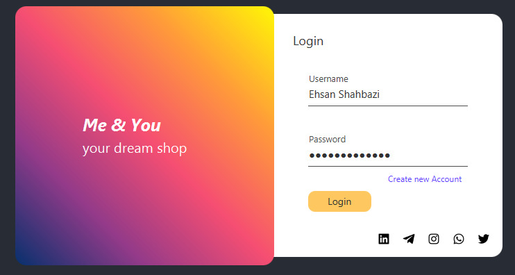
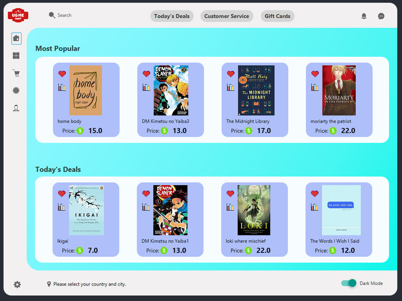
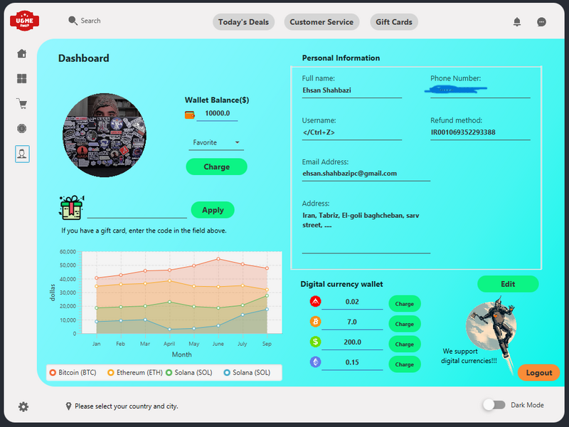
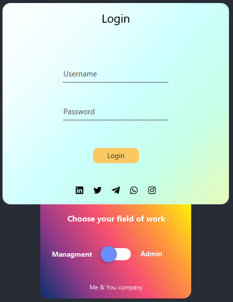
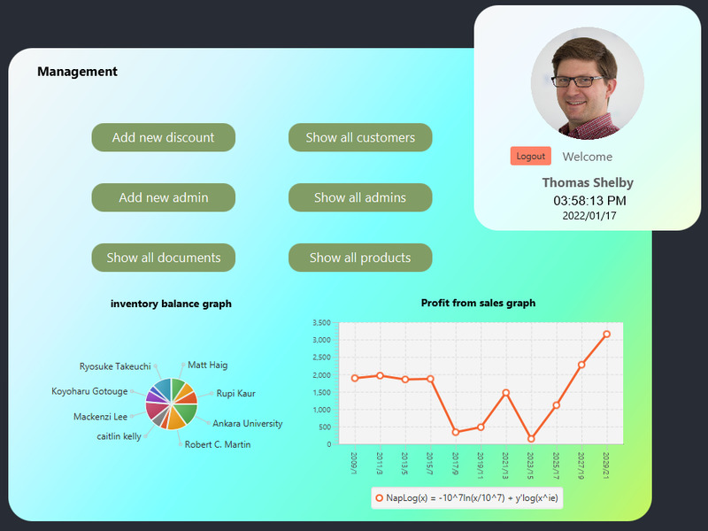

# Me-You-shop-app
## this is shop app made by java for university project. (updating)

This project is related to the final project of the Tabriz University computer basics course. The limitations that should not be broken by me in this project is that I am not allowed to use the database and I can only use the **JavaFile**. That's why I did not want to implement many options with **JavaFile**, and next semester I will develop this project with a **database** and add many options.<hr>

:red_circle:The **path** where the project folder should be placed is **D** driver. it's important notice.<br>
because in javaFile i write absolute path of files like below:<br>
```
D:\project final\src\files\data\cardInformation.txt
```
:red_circle:**Java** must be installed on your system first. Then add the **JFoenix** and **JavaFX** libraries to the project.<hr>

#### :yellow_circle:Install Java
Download an appropriate JDK for your operating system. The latest JDK can be downloaded from the official [OpenJDK](http://jdk.java.net/11/) website.<br>
Once installed, you can use the `java` command from your command line.<br><br>
Check if the correct java version is installed. The following shows the output for OpenJDK 15:
```
$ java -version
openjdk version "15" 2020-09-15
OpenJDK Runtime Environment (build 15+36-1562)
OpenJDK 64-Bit Server VM (build 15+36-1562, mixed mode, sharing)
```
You need to set the **JAVA_HOME** environment variable to the JDK installation directory. You can follow [this guide](https://www.baeldung.com/java-home-on-windows-7-8-10-mac-os-x-linux) to set JAVA_HOME for your platform.<hr>

Libraries and their versions:
- javafx-sdk-**11.0.2**
  - [download javafx-sdk-11.0.2 jar file from here](https://openjfx.io/openjfx-docs/)
- jfoenix-**9.0.10**
  - [download jfoenix-9.0.10 jar file from here](http://www.jfoenix.com)
- activation-**1.1.1**
  - [download activation-1.1.1 jar file from here](https://jar-download.com/artifacts/javax.activation/activation/1.1.1/source-code)
- javax.mail
  - [download javax.mail jar file from here](https://javaee.github.io/javamail/#Latest_News)

#### :yellow_circle:Add Library

Download these ready-made libraries and add them to your project:<br>

1. From the main menu, select **File | Project** Structure `Ctrl+Alt+Shift+S`.
2. Under **Project Settings**, select **Libraries**.
3. Click **+** Add button and select one of the following:
   - Select **Java** or **Kotlin/JS** to add a library from the files located on your computer.
   - Select From **Maven** to download a library from Maven.
References to project libraries are stored together with the project in the **.idea** folder in **libraries**.
<hr>
The project consists of two main parts, which are:

- :frowning_man:Customer application
- :office_worker:Management application

# :frowning_man:Customer part packages tree

```
src
   |-- Main
   |   |-- Controller.java
   |   |-- Main.java
   |-- controllers
   |   |-- bankingPortal
   |   |   |-- BankingPortal.java
   |   |   |-- FinalPayment.java
   |   |-- customer
   |   |   |-- Login.java
   |   |   |-- MainPage.java
   |   |   |-- ProductAnchorPane.java
   |   |   |-- ProductMainAnchorPane.java
   |   |   |-- Signin.java
   |   |-- home
   |   |   |-- GiftCard.java
   |   |   |-- Message.java
   |   |   |-- MessageComponent.java
   |   |   |-- Notification.java
   |   |   |-- NotificationComponent.java
   |   |   |-- ProductPriceLineChart.java
   |   |   |-- Service.java
   |-- files
   |   |-- data
   |   |   |-- ProductInformation.txt
   |   |   |-- cardInformation.txt
   |   |   |-- userInformation.txt
   |   |   |-- userPaymentHistory.txt
   |   |   |-- userProfileImage.txt
   |   |   |-- userWalletBalance.txt
   |   |   |-- usernameAndPassword.txt
   |   |-- image
   |   |   |-- book
   |   |   |   |-- Atomic Habits.jpg
   |   |   |   |-- Clean Code.jpg
   |   |   |   |-- DS Kimetsu no Yaiba 1.jpg
   |   |   |   |-- DS Kimetsu no Yaiba 3.jpg
   |   |   |   |-- Death Note 1.jpg
   |   |   |   |-- Ikigai.jpg
   |   |   |   |-- The Midnight Library.jpg
   |   |   |   |-- Yeni Hitit 3rd.jpg
   |   |   |   |-- home body.jpg
   |   |   |   |-- loki where mischief lies.jpg
   |   |   |   |-- moriarty the patriot 1.jpg
   |   |   |   |-- the words i wish i said.jpg
   |   |   |-- gif
   |   |   |   |-- spinner.gif
   |   |   |-- gift card
   |   |   |   |-- 25654-2-major-credit-card-logo-transparent.png
   |   |   |   |-- img-716.jpg
   |   |   |   |-- img-719.jpg
   |   |   |   |-- img-721.jpg
   |   |   |   |-- img-722.jpg
   |   |   |   |-- img-724.jpg
   |   |   |   |-- img-727.jpg
   |   |   |-- icon
   |   |   |   |-- 580b57fcd9996e24bc43c4f2.png
   |   |   |   |-- 580b57fcd9996e24bc43c518.png
   |   |   |   |-- 58419140a6515b1e0ad75a4c.png
   |   |   |   |-- 5847e991cef1014c0b5e4826.png
   |   |   |   |-- 5859902f4f6ae202fedf28d0.png
   |   |   |   |-- 587b511a44060909aa603a81.png
   |   |   |   |-- 587b518244060909aa603a8b.png
   |   |   |   |-- 5a314c90cb9a85480a628f7f.png
   |   |   |   |-- Ark-icon.png
   |   |   |   |-- Bitcoin-BTC-icon.png
   |   |   |   |-- Dollar-USD-icon.png
   |   |   |   |-- Ethereum-ETH-icon.png
   |   |   |   |-- change.png
   |   |   |   |-- dec208a64b794e63a2dcae992d9c7f85.png
   |   |   |   |-- icons8-account-64.png
   |   |   |   |-- icons8-bell-48.png
   |   |   |   |-- icons8-chart-64.png
   |   |   |   |-- icons8-coin-63.png
   |   |   |   |-- icons8-coin-64.png
   |   |   |   |-- icons8-coins-64.png
   |   |   |   |-- icons8-comment-64.png
   |   |   |   |-- icons8-favorite-50.png
   |   |   |   |-- icons8-favorite-60.png
   |   |   |   |-- icons8-gift-64.png
   |   |   |   |-- icons8-health-data-50.png
   |   |   |   |-- icons8-home-60.png
   |   |   |   |-- icons8-message-100.png
   |   |   |   |-- icons8-movie-ticket-48.png
   |   |   |   |-- icons8-search-64.png
   |   |   |   |-- icons8-settings-50.png
   |   |   |   |-- icons8-shopping-cart-50.png
   |   |   |   |-- icons8-star-48.png
   |   |   |   |-- icons8-wallet-48.png
   |   |   |   |-- instagram-logo-24.png
   |   |   |   |-- linkedin-square-logo-24.png
   |   |   |   |-- mainIcon.png
   |   |   |   |-- pngfind.com-tin-man-png-6105098.png
   |   |   |   |-- telegram-logo-24.png
   |   |   |   |-- twitter-logo-24.png
   |   |   |   |-- whatsapp-logo-24.png
   |   |   |   |-- \342\200\224Pngtree\342\200\224vector location icon_4231903.png"
   |   |   |-- profile image
   |   |   |   |-- 12-modified.png
   |   |   |   |-- 2-modified.png
   |   |   |   |-- 22-modified.png
   |   |   |   |-- 30-modified.png
   |   |   |   |-- 59-modified.png
   |   |   |   |-- 64-modified.png
   |   |   |   |-- 81-modified.png
   |   |   |   |-- 82-modified.png
   |   |   |   |-- 83-modified.png
   |   |   |   |-- 92-modified.png
   |   |   |   |-- 94-modified.png
   |   |   |   |-- Man-1-icon.png
   |   |   |   |-- Man-14-icon.png
   |   |   |   |-- Man-16-icon.png
   |   |   |   |-- Man-6-icon.png
   |   |   |   |-- Man-9-icon.png
   |   |   |   |-- Woman-15-icon.png
   |   |   |   |-- Woman-9-icon.png
   |   |   |-- service
   |   |   |   |-- icons8-lock-100.png
   |   |   |   |-- icons8-service-100.png
   |   |   |   |-- icons8-truck-100.png
   |-- modules
   |   |-- files
   |   |   |-- LoginCustomer.java
   |   |   |-- SelectAndBuyProduct.java
   |   |   |-- SigninCustomer.java
   |   |-- objects
   |   |   |-- Customer.java
   |   |   |-- Product.java
   |   |-- tools
   |   |   |-- GlobalFileTools.java
   |   |   |-- GlobalTools.java
   |   |   |-- RandomData.java
   |-- pages
   |   |-- bankingPortal
   |   |   |-- bankingPortal.fxml
   |   |   |-- finalPaymentPage.fxml
   |   |-- css
   |   |   |-- LoginStyle.css
   |   |   |-- bankingPortalStyle.css
   |   |   |-- darkMode.css
   |   |   |-- homePageStyle.css
   |   |-- customer
   |   |   |-- LoginPage.fxml
   |   |   |-- MainPage.fxml
   |   |   |-- SigninPage.fxml
   |   |   |-- productAnchorPane.fxml
   |   |   |-- productMainAnchorPane.fxml
   |   |-- home
   |   |   |-- giftCardPage.fxml
   |   |   |-- lineChartProductPage.fxml
   |   |   |-- messageComponentPage.fxml
   |   |   |-- messagePage.fxml
   |   |   |-- notificationComponentPage.fxml
   |   |   |-- notificationPage.fxml
   |   |   |-- sevicePage.fxml
```

# :frowning_man:Customer part details

### This is preview of login page in customer app


### This is preview of home page in customer app


We will first go into the details of the client project. this project made by :fire:**Java** and graphics of the program are written by **Java FX**, :rocket:**JFoenix**  useful library and the data storage part is written by **Java File**.

The customer part is divided into several parts, which are:
- :white_check_mark:Login and Sign in
- :heavy_dollar_sign:banking portal
- :gift:gift cards
- :construction_worker_man:service part
- :dizzy:home page
- :dizzy:categories
- :shopping_cart:cart tab
- :coin:digi coin
- :dizzy:dashboard

The body of the program is also divided into several parts, which are:
- :envelope:message part
- :bell:notification part
- :dizzy:dark mode toggle

There are several options, some of which are as follows:
- :framed_picture:user can change their profile picture
- :email:purchase history is emailed to the user(updating)

With this method, we perform the process of sending emails:

```
package com.company;

import java.util.Date;

import javax.mail.Message;
import javax.mail.Session;
import javax.mail.Transport;
import javax.mail.internet.InternetAddress;

import javax.mail.internet.MimeMessage;


public class EmailUtil {

    /**
     * Utility method to send simple HTML email
     * @param session
     * @param toEmail
     * @param subject
     * @param body
     */
    public static void sendEmail(Session session, String toEmail, String subject, String body){
        try
        {
            MimeMessage msg = new MimeMessage(session);
            //set message headers
            msg.addHeader("Content-type", "text/HTML; charset=UTF-8");
            msg.addHeader("format", "flowed");
            msg.addHeader("Content-Transfer-Encoding", "8bit");

            msg.setFrom(new InternetAddress("no_reply@example.com", "NoReply-JD"));

            msg.setReplyTo(InternetAddress.parse("no_reply@example.com", false));

            msg.setSubject(subject, "UTF-8");

            msg.setText(body, "UTF-8");

            msg.setSentDate(new Date());

            msg.setRecipients(Message.RecipientType.TO, InternetAddress.parse(toEmail, false));
            System.out.println("Message is ready");
            Transport.send(msg);

            System.out.println("EMail Sent Successfully!!");
        }
        catch (Exception e) {
            e.printStackTrace();
        }
    }
}

```

```
package com.company;

import java.util.Properties;
import javax.mail.*;
import javax.mail.internet.*;

public class MailSender {

    public static void SendEmail(String recepient, String Title, String Text) {
        Properties properties = new Properties();

        properties.put("mail.smtp.auth", "true");
        properties.put("mail.smtp.starttls.enable", "true");
        properties.put("mail.smtp.host", "smtp.gmail.com");
        properties.put("mail.smtp.port", "587");

        String myAccountEmail = "ehs**********@gmail.com";
        String password = "*****************";

        Session session = Session.getInstance(properties, new Authenticator() {
            @Override
            protected PasswordAuthentication getPasswordAuthentication() {
                return new PasswordAuthentication(myAccountEmail, password);
            }
        });

        Message message = new MimeMessage(session);

        try {
            message.setFrom(new InternetAddress(myAccountEmail));
            message.setRecipient(Message.RecipientType.TO, new InternetAddress(recepient));
            message.setSubject(Title);
            message.reply(false);

            message.setText(Text);

            Transport.send(message);
        } catch (Exception e) {
            e.printStackTrace();
        }
    }
}


```
<hr>
This project is not complete yet and many options will be added to the project in the near future. It is just a project version 1.0.1.<br>
I will work on the graphics of the project and make its model more modern. I also plan to create a real authentication protocol in the project.<br>
  
# :dizzy:Dashboard preview


Options that can be used in the dashboard are:
1. You can **change your profile picture** as you wish
2. On the right you will see your **personal information** and you can **edit it** whenever you want.
3. Next to your profile picture you will see the **amount of money** you have in your **wallet**.
4. You can **recharge your wallet**.
5. You can hit the gift card and **charge your wallet** with the gift cards that your friends have given you.
6. At the bottom left of the page you can see the **value of each digital currency** by month.
7. You can also make **purchases with digital currencies** (not yet available)
8. You can choose your **location or country** and do not need to enter the address manually (not yet available)
9. There is also **Dark Mode and Light Mode** and you can use it according to your taste
10. **Automatically switches** the theme to Dark Mode or Light Mode (not yet available)
<hr>

# :office_worker:Management part packages tree
```
 |-- project final managment.iml
   |-- src
   |   |-- Main
   |   |   |-- Controller.java
   |   |   |-- Main.java
   |   |-- controllers
   |   |   |-- Login
   |   |   |   |-- Login.java
   |   |   |-- Management
   |   |   |   |-- AddNewAdmin.java
   |   |   |   |-- AddNewDiscount.java
   |   |   |   |-- Management.java
   |   |   |   |-- ShowAllAdmins.java
   |   |   |   |-- ShowAllCustomers.java
   |   |   |   |-- ShowAllDocuments.java
   |   |   |   |-- ShowAllProducts.java
   |   |   |-- admin
   |   |   |   |-- AddNewProduct.java
   |   |   |   |-- Admin.java
   |   |   |   |-- ShowAllProductsAdmin.java
   |   |-- files
   |   |   |-- data
   |   |   |   |-- adminProfiles.txt
   |   |   |   |-- discountDetails.txt
   |   |   |   |-- managementAndAdminLogin.txt
   |   |   |   |-- managementProfile.txt
   |   |   |   |-- userProfileImages.txt
   |   |   |-- image
   |   |   |   |-- book
   |   |   |   |   |-- Clean Code.jpg
   |   |   |   |   |-- Death Note 1.jpg
   |   |   |   |   |-- Yeni Hitit 3rd.jpg
   |   |   |   |   |-- home body.jpg
   |   |   |   |   |-- the words i wish i said.jpg
   |   |   |   |-- gif
   |   |   |   |   |-- spinner.gif
   |   |   |   |-- gift card
   |   |   |   |   |-- img-716.jpg
   |   |   |   |   |-- img-719.jpg
   |   |   |   |   |-- img-721.jpg
   |   |   |   |   |-- img-722.jpg
   |   |   |   |   |-- img-724.jpg
   |   |   |   |   |-- img-727.jpg
   |   |   |   |-- icon
   |   |   |   |   |-- 580b57fcd9996e24bc43c4f2.png
   |   |   |   |   |-- 580b57fcd9996e24bc43c518.png
   |   |   |   |   |-- 58419140a6515b1e0ad75a4c.png
   |   |   |   |   |-- 5847e991cef1014c0b5e4826.png
   |   |   |   |   |-- 5859902f4f6ae202fedf28d0.png
   |   |   |   |   |-- 587b511a44060909aa603a81.png
   |   |   |   |   |-- 587b518244060909aa603a8b.png
   |   |   |   |   |-- 5a314c90cb9a85480a628f7f.png
   |   |   |   |   |-- Ark-icon.png
   |   |   |   |   |-- Bitcoin-BTC-icon.png
   |   |   |   |   |-- Dollar-USD-icon.png
   |   |   |   |   |-- Ethereum-ETH-icon.png
   |   |   |   |   |-- change.png
   |   |   |   |   |-- dec208a64b794e63a2dcae992d9c7f85.png
   |   |   |   |   |-- icons8-account-64.png
   |   |   |   |   |-- icons8-bell-48.png
   |   |   |   |   |-- icons8-chart-64.png
   |   |   |   |   |-- icons8-coin-63.png
   |   |   |   |   |-- icons8-coin-64.png
   |   |   |   |   |-- icons8-coins-64.png
   |   |   |   |   |-- icons8-comment-64.png
   |   |   |   |   |-- icons8-favorite-50.png
   |   |   |   |   |-- icons8-favorite-60.png
   |   |   |   |   |-- icons8-gift-64.png
   |   |   |   |   |-- icons8-health-data-50.png
   |   |   |   |   |-- icons8-home-60.png
   |   |   |   |   |-- icons8-movie-ticket-48.png
   |   |   |   |   |-- icons8-search-64.png
   |   |   |   |   |-- icons8-settings-50.png
   |   |   |   |   |-- icons8-shopping-cart-50.png
   |   |   |   |   |-- icons8-star-48.png
   |   |   |   |   |-- icons8-wallet-48.png
   |   |   |   |   |-- instagram-logo-24.png
   |   |   |   |   |-- linkedin-square-logo-24.png
   |   |   |   |   |-- mainIcon.png
   |   |   |   |   |-- pngfind.com-tin-man-png-6105098.png
   |   |   |   |   |-- telegram-logo-24.png
   |   |   |   |   |-- twitter-logo-24.png
   |   |   |   |   |-- whatsapp-logo-24.png
   |   |   |   |   |-- \342\200\224Pngtree\342\200\224vector location icon_4231903.png"
   |   |   |   |-- profile image
   |   |   |   |   |-- Man-1-icon.png
   |   |   |   |   |-- Man-14-icon.png
   |   |   |   |   |-- Man-16-icon.png
   |   |   |   |   |-- Man-6-icon.png
   |   |   |   |   |-- Man-9-icon.png
   |   |   |   |   |-- Woman-15-icon.png
   |   |   |   |   |-- Woman-9-icon.png
   |   |   |   |-- service
   |   |   |   |   |-- icons8-lock-100.png
   |   |   |   |   |-- icons8-service-100.png
   |   |   |   |   |-- icons8-truck-100.png
   |   |-- modules
   |   |   |-- charts
   |   |   |   |-- LineChartData.java
   |   |   |   |-- PieChartData.java
   |   |   |-- files
   |   |   |   |-- LoginCheck.java
   |   |   |   |-- SigninAdmin.java
   |   |   |-- object
   |   |   |   |-- Discount.java
   |   |   |   |-- Person.java
   |   |   |   |-- Product.java
   |   |   |-- tools
   |   |   |   |-- DigitalClock.java
   |   |   |   |-- DigitalTime.java
   |   |   |   |-- GlobalFileTools.java
   |   |   |   |-- GlobalTools.java
   |   |   |   |-- RandomData.java
   |   |-- pages
   |   |   |-- admin
   |   |   |   |-- addNewProductPage.fxml
   |   |   |   |-- adminPage.fxml
   |   |   |   |-- showAllProductPage.fxml
   |   |   |-- css
   |   |   |   |-- loginStyle.css
   |   |   |   |-- tableStyle.css
   |   |   |-- login
   |   |   |   |-- LoginPage.fxml
   |   |   |-- managment
   |   |   |   |-- addNewAdmin.fxml
   |   |   |   |-- addNewDiscountPage.fxml
   |   |   |   |-- managementPage.fxml
   |   |   |   |-- showAllAdminPage.fxml
   |   |   |   |-- showAllCustomerPage.fxml
   |   |   |   |-- showAllDocumentPage.fxml
   |   |   |   |-- showAllProductPage.fxml
```

# :office_worker:Management part details

### This is preview of login page in management app


### This is preview of home page in management app


Options that Management can be used in the dashboard are:
1. view all **customer information** except their **password**.
2. view all **employee information**.
3. view all the **information of the goods** that are in **stock**.
4. View the **discount code** and create a **new discount code**.
5. Hire a **new employee** and save the information.
6. View **documentation and all purchase information, profits and taxes**.
7. On the right, it sees the **date and time** live.
8. **change your profile picture** as he wish
9. see the **number and profit of goods instantly** at the bottom of the page.
